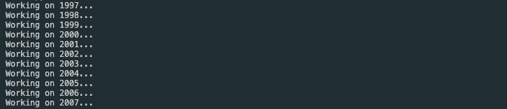

# STIS Archive Inspector
A Dash-based archive inspector for STIS. Provides an interactive, visual interface for exploring the STIS archive.

## Running the Archive Inspector

The STIS Archive Inspector is run by executing the `run.py` script.

The Archive Inspector will first fetch metadata from the archive and generate a local csv file:

