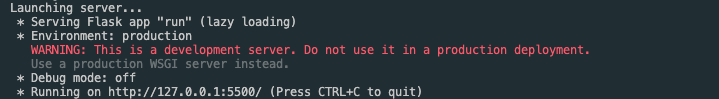
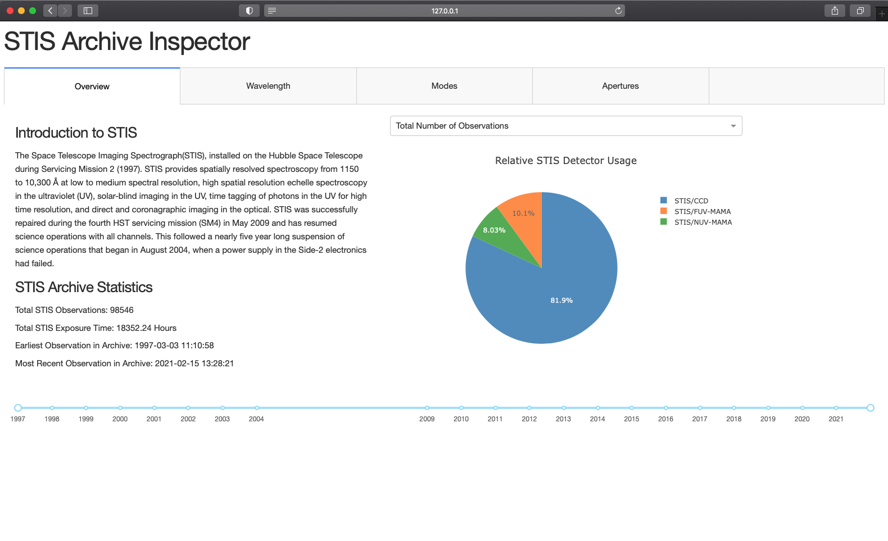

# STIS Archive Inspector
A Dash-based archive inspector for STIS. Provides an interactive, visual interface for exploring the STIS archive.

## Running the Archive Inspector

The STIS Archive Inspector is run by executing the `run.py` script.

The Archive Inspector will first fetch metadata from the archive and generate a local csv file titled `stis_archive.csv`:

This metadata fetch will occur so long as the `gen_csv` flag in `config.py` is set to `True`. If set to `False`, the Archive Inspector will attempt to load an existing `stis_archive.csv` file that already exists in the directory. If you wish to run the Archive Inspector multiple times in a short timespan, setting this flag to `False` will allow you to avoid having the fetch the metadata multiple times. Keep in mind that these archive files will not continually track any additionally observations added to the STIS archive without a refetch.

After fetching the metadata, the Archive Inspector will launch a local server and post the local address and port in terminal.

Paste the address and port into your preferred web browser to use the Archive Inspector. Keep in mind that the terminal used to run the Archive Inspector will need to remain open for the application to function.

